# LaVie: High-Quality Video Generation with Cascaded Latent Diffusion Models

This repository is the official PyTorch implementation of [LaVie](https://arxiv.org/abs/2309.15103).

**LaVie** is a Text-to-Video (T2V) generation framework, and main part of video generation system [Vchitect](http://vchitect.intern-ai.org.cn/). You can also check our fine-tuned Image-to-Video (I2V) model [SEINE](https://github.com/Vchitect/SEINE).


[](https://arxiv.org/abs/2309.15103)
[](https://vchitect.github.io/LaVie-project/)
[](https://replicate.com/cjwbw/lavie)
[](https://huggingface.co/spaces/Vchitect/LaVie)
[](https://openxlab.org.cn/apps/detail/houshaowei/LaVie)
[](https://hits.seeyoufarm.com)


<!--
[]()
-->

## News
__[2024.07.08]__: **LaVie-2** will be released soon, stay tuned!
<video poster="https://github.com/Vchitect/LaVie/assets/7929326/f54662e9-7641-4173-99ca-db7592d086c3" preload="auto" src="https://github.com/Vchitect/LaVie/assets/7929326/196ee3ca-f106-433a-8edc-7803f2f11aa4" width="800"></video>

<!--

-->

## Installation
```
conda env create -f environment.yml 
conda activate lavie
```

## Download Pre-Trained models
Download pre-trained [LaVie models](https://huggingface.co/YaohuiW/LaVie/tree/main), [Stable Diffusion 1.4](https://huggingface.co/CompVis/stable-diffusion-v1-4/tree/main), [stable-diffusion-x4-upscaler](https://huggingface.co/stabilityai/stable-diffusion-x4-upscaler/tree/main) to `./pretrained_models`. You should be able to see the following:
```
├── pretrained_models
│   ├── lavie_base.pt
│   ├── lavie_interpolation.pt
│   ├── lavie_vsr.pt
│   ├── stable-diffusion-v1-4
│   │   ├── ...
└── └── stable-diffusion-x4-upscaler
        ├── ...
```
Gallery:

<table class="center">

<tr>
  <td>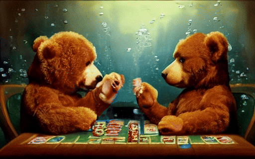</td>
  <td>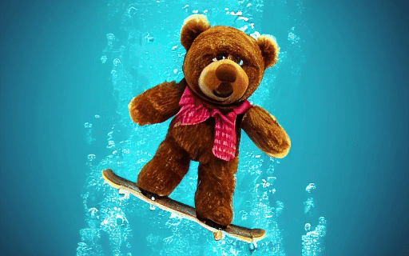</td>
  <td>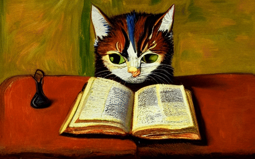</td>      
</tr>

<tr>
  <td>two teddy bears playing poker under water, highly detailed, oil painting style</td>
  <td>a teddy bear skateboarding under water, highly detailed</td>
  <td>a cat reading a book on the table, Van Gogh style</td>      
</tr>
        
<tr>
  <td>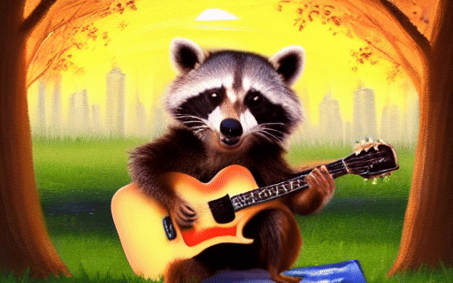</td>
  <td>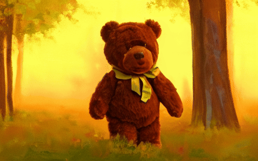</td>
  <td>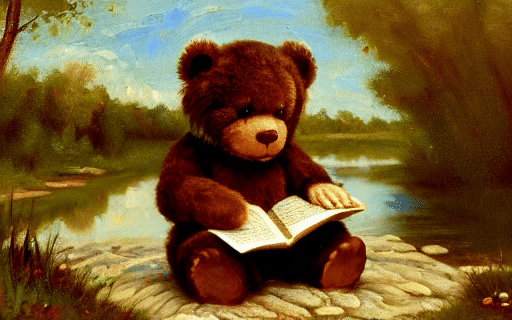</td>      
</tr>

<tr>
  <td>a cute raccoon playing guitar in the park at sunrise, oil painting style</td>
  <td>a teddy bear walking in the park at sunrise, oil painting style</td>
  <td>a teddy bear reading a book near a small river, oil painting style</td>      
</tr>

<tr>
  <td>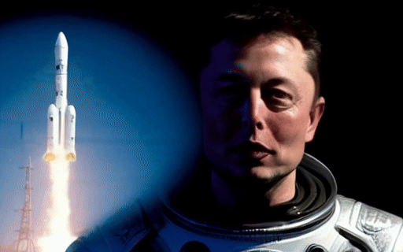</td>
  <td>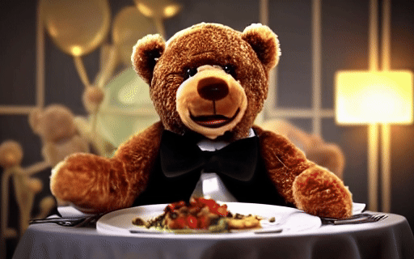</td>
  <td>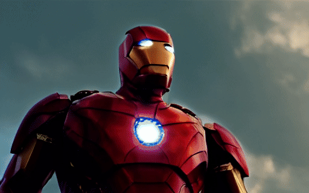</td>      
</tr>

<tr>
  <td>Elon Musk in a space suit standing besides a rocket, high quality</td>
  <td>a teddy bear in a suit having dinner in a well-decorated house</td>
  <td>Iron Man flying in the sky, 4k, high quality</td>      
</tr>

</table>

Feel free to try different prompts, and share with us which one you like the most!


## Inference
The inference contains **Base T2V**, **Video Interpolation** and **Video Super-Resolution** three steps. We provide several options to generate videos:

|       |Step1|Step2|Step3|Resolution|Length|
|-------|-----|-----|-----|----------|------|
|option1|  ✔  |     |     | 320x512  |  16  |
|option2|  ✔  |  ✔  |     | 320x512  |  61  |
|option3|  ✔  |     |  ✔  | 1280x2048|  16  |
|option4|  ✔  |  ✔  |  ✔  | 1280x2048|  61  |

Feel free to try different options :)


### Step1. Base T2V
Run following command to generate videos from base T2V model. 
```
cd base
python pipelines/sample.py --config configs/sample.yaml
```
In **configs/sample.yaml**, arguments for inference:

- **ckpt_path:** Path to the downloaded LaVie base model, default is `../pretrained_models/lavie_base.pt`

- **pretrained_models:** Path to the downloaded SD1.4, default is `../pretrained_models`

- **output_folder:** Path to save generated results, default is `../res/base`

- **seed:** Seed to be used, `None` for random generation

- **sample_method:** Scheduler to use, default is `ddpm`, options are `ddpm`, `ddim` and `eulerdiscrete`

- **guidance_scale:** CFG scale to use, default is `7.5`

- **num_sampling_steps:** Denoising steps, default is `50`

- **text_prompt:** Prompt for generation

Following results were generated with the arguments:

seed: `400`, sample_method: `ddpm`, guidance_scale: `7.0`, num_sampling_steps: `50`

(you might obtain different results on different device)

<table class="center">
<tr>
  <td>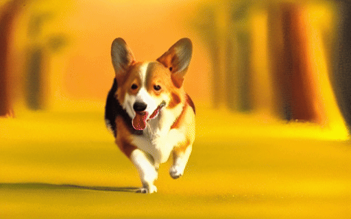</td>
  <td>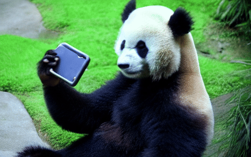</td>
  <td></td>      
</tr>

<tr>
  <td>a Corgi walking in the park at sunrise, oil painting style</td>
  <td>a panda taking a selfie, 2k, high quality</td>
  <td>a polar bear playing drum kit in NYC Times Square, 4k, high resolution</td>      
</tr>

<tr>
  <td>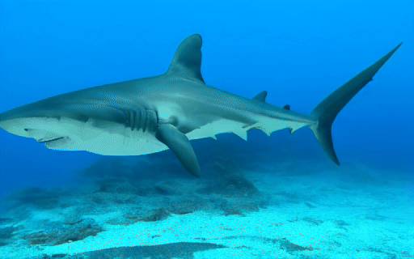</td>
  <td>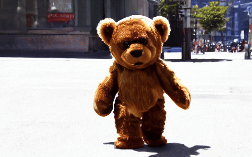</td>
  <td></td>
</tr>

<tr>
  <td>a shark swimming in clear Carribean ocean, 2k, high quality</td>
  <td>a teddy bear walking on the street, 2k, high quality</td>
  <td>jungle, river, at sunset, ultra quality</td>
</tr>

</table>

### Step2 (optional). Video Interpolation
Run following command to conduct video interpolation.
```
cd interpolation
python sample.py --config configs/sample.yaml
```
The default input video path is `./res/base`, results will be saved under `./res/interpolation`. In `configs/sample.yaml`, you could modify default `input_folder` with `YOUR_INPUT_FOLDER` in `configs/sample.yaml`. Input videos should be named as `prompt1.mp4`, `prompt2.mp4`, ... and put under `YOUR_INPUT_FOLDER`. Launching the code will process all the input videos in `input_folder`.

### Step3 (optional). Video Super-Resolution
Run following command to conduct video super-resolution.
```
cd vsr
python sample.py --config configs/sample.yaml
```
The default input video path is `./res/base` and results will be saved under `./res/vsr`. You could modify default `input_path` with `YOUR_INPUT_FOLDER` in `configs/sample.yaml`. Similar to Step2, input videos should be named as `prompt1.mp4`, `prompt2.mp4`, ... and put under `YOUR_INPUT_FOLDER`. Launching the code will process all the input videos in `input_folder`.

## BibTex
```bibtex
@article{wang2023lavie,
  title={LAVIE: High-Quality Video Generation with Cascaded Latent Diffusion Models},
  author={Wang, Yaohui and Chen, Xinyuan and Ma, Xin and Zhou, Shangchen and Huang, Ziqi and Wang, Yi and Yang, Ceyuan and He, Yinan and Yu, Jiashuo and Yang, Peiqing and others},
  journal={arXiv preprint arXiv:2309.15103},
  year={2023}
}
```

```bibtex
@article{chen2023seine,
title={SEINE: Short-to-Long Video Diffusion Model for Generative Transition and Prediction},
author={Chen, Xinyuan and Wang, Yaohui and Zhang, Lingjun and Zhuang, Shaobin and Ma, Xin and Yu, Jiashuo and Wang, Yali and Lin, Dahua and Qiao, Yu and Liu, Ziwei},
journal={arXiv preprint arXiv:2310.20700},
year={2023}
}
```

## Disclaimer
We disclaim responsibility for user-generated content. The model was not trained to realistically represent people or events, so using it to generate such content is beyond the model's capabilities. It is prohibited for pornographic, violent and bloody content generation, and to generate content that is demeaning or harmful to people or their environment, culture, religion, etc. Users are solely liable for their actions. The project contributors are not legally affiliated with, nor accountable for users' behaviors. Use the generative model responsibly, adhering to ethical and legal standards.

## Contact Us
**Yaohui Wang**: [wangyaohui@pjlab.org.cn](mailto:wangyaohui@pjlab.org.cn)  
**Xinyuan Chen**: [chenxinyuan@pjlab.org.cn](mailto:chenxinyuan@pjlab.org.cn)  
**Xin Ma**: [xin.ma1@monash.edu](mailto:xin.ma1@monash.edu)

## Acknowledgements
The code is built upon [diffusers](https://github.com/huggingface/diffusers) and [Stable Diffusion](https://github.com/CompVis/stable-diffusion), we thank all the contributors for open-sourcing. 


## License
The code is licensed under Apache-2.0, model weights are fully open for academic research and also allow **free** commercial usage. To apply for a commercial license, please contact vchitect@pjlab.org.cn.
